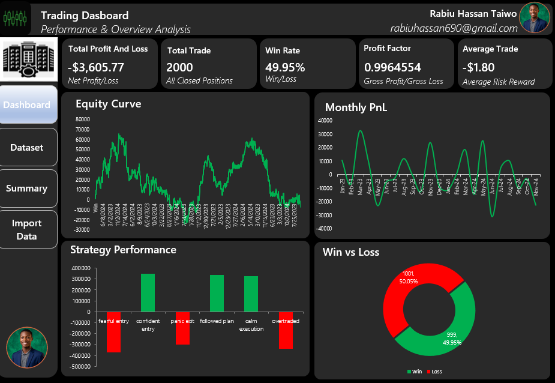

# Automated-Trading-Intelligence-Dashboard
Built a fully automated trading analytics system that processes, analyzes, and visualizes trading performance data. Designed to function like a lightweight BI tool within Excel.
A fully automated trading analytics system built in Excel using VBA.  
This project transforms raw trade data into actionable insights through custom logic, dynamic visualization, and interactive controls.

# 📊 Trading Analytics Dashboard (Excel + VBA)

## Overview

This project is a **fully automated trading analytics system built in Excel using VBA**.  
It goes beyond simple trade tracking and focuses on **performance analysis, decision-making, and behavioral insights**.

The system was developed using a problem-solving approach inspired by the **Black Cat Theory**:
> Even without full clarity, progress comes from continuous testing, iteration, and structured thinking.

---
## 📷 Preview

---
## 🚀 Key Features

### 🧩 Data Engine
- Structured `Trade_Log` dataset
- VBA-driven calculations (no heavy reliance on formulas)
- Dictionary-based aggregation for speed and flexibility

### 📈 Analytics & Metrics
- Total PnL
- Win Rate
- Profit Factor
- Average Trade Value
- Monthly Performance Trends

### 📊 Dashboard
- Equity Curve (Cumulative PnL)
- Strategy Performance
- Psychology-based analysis
- Win vs Loss distribution

### 🎛️ Interactivity
- Power BI–style button filters (VBA-driven)
- Dynamic measure switching:
  - PnL
  - Trade Count
- Real-time dashboard refresh

### 🧠 Behavioral Tracking
- Trade psychology notes
- Aggregated performance by mental state

### 🖥️ User Experience
- Custom UserForm for trade entry
- Input validation and authentication
- Clean, structured UI

---

## ⚙️ Technical Approach

- Built entirely in **Excel VBA**
- Avoided PivotTables for greater control
- Implemented **Scripting.Dictionary** for data aggregation
- Optimized for performance (~2000+ trades under 5 seconds)

---

## 🧠 What This Project Demonstrates

- Strong problem-solving and analytical thinking
- Ability to design systems from scratch
- Understanding of data structures and performance optimization
- Practical application of VBA for real-world analytics

---

## 📌 Key Insight

This project wasn’t built from a template.  
It was developed through **iteration, debugging, and continuous refinement**—turning uncertainty into structure.

---

## 📎 Future Improvements

- Advanced risk metrics (Sharpe Ratio, Drawdown)
- Enhanced UI styling
- Integration with live trading data APIs

---

## 👤 Author

**Rabiu Hassan**  
Data Analytics Enthusiast | Building systems that turn data into decisions
